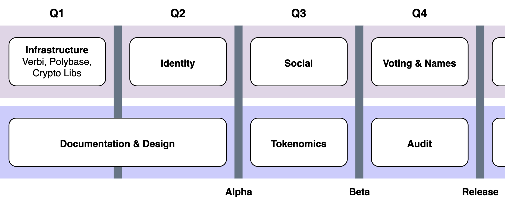

# 👋 Introduction

## Purpose

Our main goal is to develop a digital platform that provides the infrastructure for developing and deploying modern applications. We strive to create products that will help our customers increase their efficiency and competitive advantage in the market. Our team is also focused on creating our own modern services that meet high quality and security standards. We understand that technology is constantly evolving, so we are always on the lookout for new products and strive to use the most advanced solutions to achieve the best results.

## Decentralization

Our platform provides developers with the ability to create decentralized applications, which is one of its main advantages. Decentralized applications use a distributed architecture that allows them to operate without dependence on a central server or controller. Applications of this type can store data on different network nodes, providing a high degree of security and availability.

## Roadmap

<figure><figcaption></figcaption></figure>
