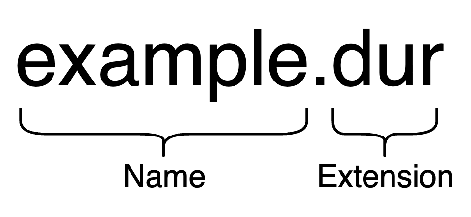

# 🏷 Names

## Account

Durudex names can be linked to a Durudex account, making it easier and quicker for other users to find a particular account. This is especially useful if you want to send someone cryptocurrency without knowing their address, as all you need to do is enter the username and the wallet will automatically find the address.

## Structure

<figure><figcaption></figcaption></figure>

## Extension

An extension is the part of a name that comes after the base name. It is necessary to make the name unique and can be used to identify a specific website or account.

### Extension List

<table><thead><tr><th align="center">Extension</th><th data-type="checkbox">Public</th><th align="center">Description</th></tr></thead><tbody><tr><td align="center"><code>.durudex</code></td><td>false</td><td align="center">A custom extension that is used exclusively for Durudex applications.</td></tr><tr><td align="center"><code>.dur</code></td><td>true</td><td align="center">The main extension of the Durudex network.</td></tr><tr><td align="center"><code>.ver</code></td><td>true</td><td align="center">An extension that was created for applications built on the Verba Web framework.</td></tr></tbody></table>
